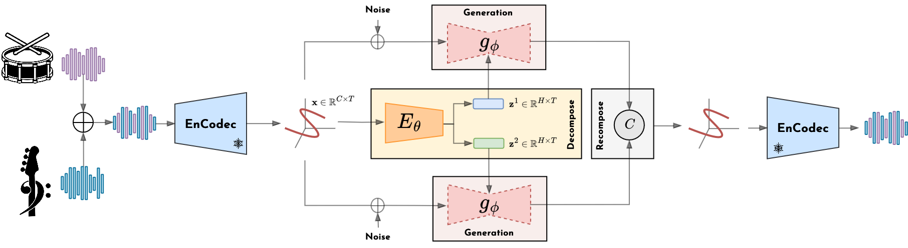

# Unsupervised Composable Representations For Audio 

## Abstract

Current generative models are able to generate high-quality artefacts but have been shown to struggle with compositional reasoning, which can be defined as the ability to generate complex structures from simpler elements. In this paper, we focus on the problem of compositional representation learning for music data, specifically targeting the fully-unsupervised setting. We propose a simple and extensible framework that leverages an explicit compositional inductive bias, defined by a flexible auto-encoding objective that can leverage any of the current state-of-art generative models. We demonstrate that our framework, used with diffusion models, naturally addresses the task of unsupervised audio source separation, showing that our model is able to perform high-quality separation. Our findings reveal that our proposal achieves comparable or superior performance with respect to other blind source separation methods and, furthermore, it even surpasses current state-of-art supervised baselines on signal-to-interference ratio metrics. Additionally, by learning an a-posteriori masking diffusion model in the space of composable representations, we achieve a system capable of seamlessly performing unsupervised source separation, unconditional generation, and variation generation. Finally, as our proposal works in the latent space of pre-trained neural audio codecs, it also provides a lower computational cost with respect to other neural baselines.

  

## Reconstructions

Here, we show some *non-cherry-picked* examples of the reconstructions obtained by our model on the Slakh2100 test set. **Warning**: lower the volume before playing the audio files, as they may be loud.

| Sample | Original                                                                  | Reconstruction                                                           |
|--------|---------------------------------------------------------------------------|--------------------------------------------------------------------------|
| 1      | <audio src="audio/rec/orig_1.wav" controls style="width:  200px"></audio> | <audio src="audio/rec/rec_1.wav" controls style="width:  200px"></audio> |
| 2      | <audio src="audio/rec/orig_2.wav" controls style="width:  200px"></audio> | <audio src="audio/rec/rec_2.wav" controls style="width:  200px"></audio> |
| 3      | <audio src="audio/rec/orig_3.wav" controls style="width:  200px"></audio> | <audio src="audio/rec/rec_3.wav" controls style="width:  200px"></audio> |

## Separations

Here, we show some *non-cherry-picked* examples of the separations obtained by our model on the Slakh2100 test set (*Drums + Bass*). **Warning**: lower the volume before playing the audio files, as they may be loud.

### Drums + Bass

| Sample | Original                                                             | Bass (original)                                                           | Bass (ours)                                                                    | Drums (original)                                                           | Drums (ours)                                                                    |
|--------|----------------------------------------------------------------------|---------------------------------------------------------------------------|--------------------------------------------------------------------------------|----------------------------------------------------------------------------|---------------------------------------------------------------------------------|
| 1      | <audio src="audio/sep/ours/1.wav" controls style="width:  200px"></audio> | <audio src="audio/sep/ours/1_bass.wav" controls style="width:  200px"></audio> | <audio src="audio/sep/ours/1_bass_ours.wav" controls style="width:  200px"></audio> | <audio src="audio/sep/ours/1_drums.wav" controls style="width:  200px"></audio> | <audio src="audio/sep/ours/1_drums_ours.wav" controls style="width:  200px"></audio> |
| 2      | <audio src="audio/sep/ours/2.wav" controls style="width:  200px"></audio> | <audio src="audio/sep/ours/2_bass.wav" controls style="width:  200px"></audio> | <audio src="audio/sep/ours/2_bass_ours.wav" controls style="width:  200px"></audio> | <audio src="audio/sep/ours/2_drums.wav" controls style="width:  200px"></audio> | <audio src="audio/sep/ours/2_drums_ours.wav" controls style="width:  200px"></audio> |
| 3      | <audio src="audio/sep/ours/3.wav" controls style="width:  200px"></audio> | <audio src="audio/sep/ours/3_bass.wav" controls style="width:  200px"></audio> | <audio src="audio/sep/ours/3_bass_ours.wav" controls style="width:  200px"></audio> | <audio src="audio/sep/ours/3_drums.wav" controls style="width:  200px"></audio> | <audio src="audio/sep/ours/3_drums_ours.wav" controls style="width:  200px"></audio> |

### Bass + Piano

Here, we show some *non-cherry-picked* examples of the separations obtained by our model on the Slakh2100 test set (*Bass + Piano*). **Warning**: lower the volume before playing the audio files, as they may be loud.

| Sample | Original                                                                     | Bass (original)                                                                   | Bass (ours)                                                                            | Piano (original)                                                                   | Piano (ours)                                                                            |
|--------|------------------------------------------------------------------------------|-----------------------------------------------------------------------------------|----------------------------------------------------------------------------------------|------------------------------------------------------------------------------------|-----------------------------------------------------------------------------------------|
| 1      | <audio src="audio/sep/ours_dp/1.wav" controls style="width:  200px"></audio> | <audio src="audio/sep/ours_dp/1_bass.wav" controls style="width:  200px"></audio> | <audio src="audio/sep/ours_dp/1_bass_ours.wav" controls style="width:  200px"></audio> | <audio src="audio/sep/ours_dp/1_piano.wav" controls style="width:  200px"></audio> | <audio src="audio/sep/ours_dp/1_piano_ours.wav" controls style="width:  200px"></audio> |
| 2      | <audio src="audio/sep/ours_dp/2.wav" controls style="width:  200px"></audio> | <audio src="audio/sep/ours_dp/2_bass.wav" controls style="width:  200px"></audio> | <audio src="audio/sep/ours_dp/2_bass_ours.wav" controls style="width:  200px"></audio> | <audio src="audio/sep/ours_dp/2_piano.wav" controls style="width:  200px"></audio> | <audio src="audio/sep/ours_dp/2_piano_ours.wav" controls style="width:  200px"></audio> |
| 3      | <audio src="audio/sep/ours_dp/3.wav" controls style="width:  200px"></audio> | <audio src="audio/sep/ours_dp/3_bass.wav" controls style="width:  200px"></audio> | <audio src="audio/sep/ours_dp/3_bass_ours.wav" controls style="width:  200px"></audio> | <audio src="audio/sep/ours_dp/3_piano.wav" controls style="width:  200px"></audio> | <audio src="audio/sep/ours_dp/3_piano_ours.wav" controls style="width:  200px"></audio> |

## Generations